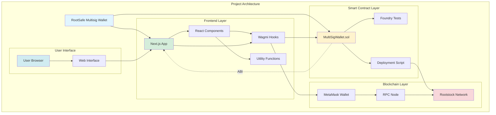
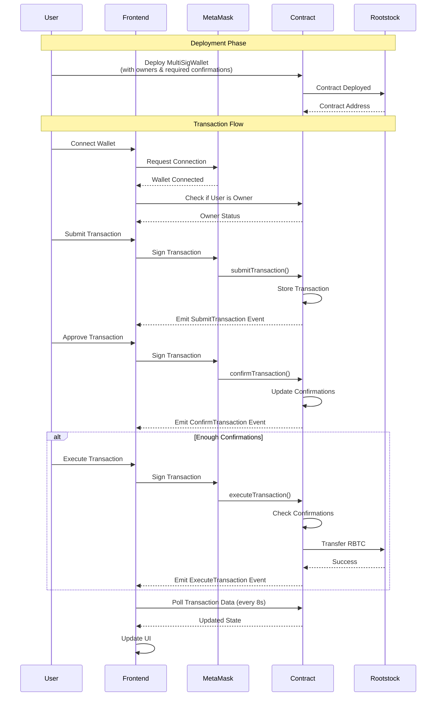
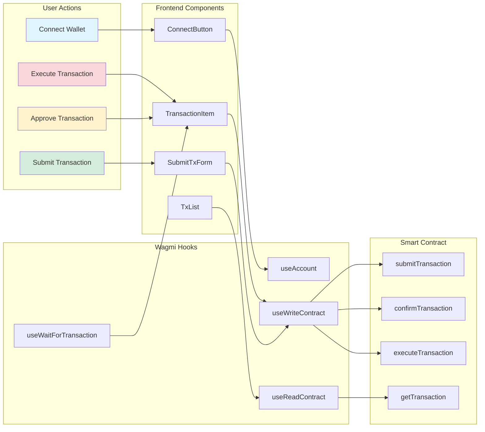

# RootSafe Multisig Wallet

A complete Replit-based Rootstock Multisignature Wallet Demo showcasing secure transaction approvals and multi-party control on Rootstock (RSK) blockchain. This project demonstrates Rootstock's EVM compatibility through a fully functional multisig wallet with both smart contract and web interface.

## 📋 Table of Contents

- [Overview](#overview)
- [Features](#features)
- [Project Structure](#project-structure)
- [Quick Start](#quick-start)
- [Smart Contract](#smart-contract)
- [Frontend](#frontend)
- [Architecture](#architecture)
- [Security Considerations](#security-considerations)
- [Contributing](#contributing)
- [License](#license)

## 🎯 Overview

RootSafe Multisig Wallet is a production-ready demonstration of a multisignature wallet on Rootstock blockchain. It consists of:

1. **Smart Contract** - A secure, gas-optimized multisig wallet contract built with Foundry
2. **Frontend** - A modern Next.js web application with TypeScript, wagmi, and Tailwind CSS

The wallet requires multiple owner approvals (M-of-N scheme) before executing transactions, providing enhanced security for managing RBTC and interacting with smart contracts.



## ✨ Features

### Smart Contract Features
- ✅ Multi-owner support (configurable number of owners)
- ✅ Configurable required confirmations (M-of-N scheme)
- ✅ Transaction submission, confirmation, and execution
- ✅ Confirmation revocation (before execution)
- ✅ Safe ETH/RBTC transfers using `call()`
- ✅ Reentrancy protection with OpenZeppelin's ReentrancyGuard
- ✅ Comprehensive event logging
- ✅ Gas-efficient design
- ✅ Full Foundry test coverage

### Frontend Features
- ✅ Modern Next.js 14 with App Router
- ✅ TypeScript for type safety
- ✅ Wagmi + Viem for blockchain interaction
- ✅ MetaMask wallet integration
- ✅ Real-time transaction updates (polling)
- ✅ Transaction filters and search
- ✅ Transaction details modal
- ✅ Owner management UI
- ✅ Wallet dashboard with charts
- ✅ Dark/light theme toggle
- ✅ Responsive design with Tailwind CSS
- ✅ Toast notifications
- ✅ Loading states and skeletons

## 📁 Project Structure

```
RootSafe_Multisig_Wallet/
├── contracts/                 # Smart contract project (Foundry)
│   ├── src/
│   │   └── MultiSigWallet.sol
│   ├── test/
│   │   └── MultiSigWallet.t.sol
│   ├── script/
│   │   └── DeployMultiSig.s.sol
│   ├── lib/
│   │   ├── openzeppelin-contracts/
│   │   └── forge-std/
│   ├── out/                   # Compiled artifacts and ABIs
│   ├── foundry.toml
│   └── README.md
│
├── frontend/                  # Frontend project (Next.js)
│   ├── src/
│   │   ├── app/               # Next.js app router
│   │   │   ├── layout.tsx
│   │   │   ├── page.tsx
│   │   │   ├── providers.tsx
│   │   │   └── globals.css
│   │   ├── components/        # React components
│   │   │   ├── ConnectButton.tsx
│   │   │   ├── SubmitTxForm.tsx
│   │   │   ├── TxList.tsx
│   │   │   ├── TransactionItem.tsx
│   │   │   ├── OwnersList.tsx
│   │   │   ├── Navigation.tsx
│   │   │   ├── Footer.tsx
│   │   │   └── ...
│   │   ├── lib/               # Utilities
│   │   │   ├── contract.ts
│   │   │   └── utils.ts
│   │   └── abi/               # Contract ABIs
│   │       └── MultiSigWallet.json
│   ├── .env.local.example
│   ├── next.config.js
│   ├── tailwind.config.js
│   ├── package.json
│   └── README.md
│
└── README.md                   # This file
```

## 🚀 Quick Start

### Prerequisites

- [Foundry](https://book.getfoundry.sh/getting-started/installation) (for smart contracts)
- Node.js 18+ (for frontend)
- MetaMask browser extension
- Rootstock Testnet RBTC (for deployment and gas)

### 1. Clone the Repository

```bash
git clone <repository-url>
cd RootSafe_Multisig_Wallet
```

### 2. Deploy Smart Contract

```bash
cd contracts

# Install dependencies
forge install

# Set up environment variables
cp .env.example .env
# Edit .env with your PRIVATE_KEY and ROOTSTOCK_TESTNET_RPC

# Run tests
forge test

# Deploy to Rootstock Testnet
forge script script/DeployMultiSig.s.sol:DeployMultiSig \
  --rpc-url $ROOTSTOCK_TESTNET_RPC \
  --private-key $PRIVATE_KEY \
  --broadcast
```

Save the deployed contract address for the frontend.

### 3. Set Up Frontend

```bash
cd ../frontend

# Install dependencies
npm install

# Copy ABI from contracts
cp ../contracts/out/MultiSigWallet.sol/MultiSigWallet.json src/abi/
# Extract ABI (see frontend/README.md for details)

# Set up environment variables
cp .env.local.example .env.local
# Edit .env.local with your contract address and RPC URL

# Run development server
npm run dev
```

Open [http://localhost:3000](http://localhost:3000) in your browser.

## 📦 Smart Contract

The smart contract is built with Foundry and implements a secure multisignature wallet. See [contracts/README.md](./contracts/README.md) for detailed documentation.

**Key Files:**
- `contracts/src/MultiSigWallet.sol` - Main contract
- `contracts/test/MultiSigWallet.t.sol` - Test suite
- `contracts/script/DeployMultiSig.s.sol` - Deployment script

## 🎨 Frontend

The frontend is built with Next.js 14, TypeScript, wagmi, and Tailwind CSS. See [frontend/README.md](./frontend/README.md) for detailed documentation.

**Key Features:**
- Wallet connection via MetaMask
- Transaction submission and management
- Real-time updates
- Responsive design
- Dark/light theme

## 🏗️ Architecture

### System Flow



### Component Interaction



## 🔒 Security Considerations

1. **Smart Contract Security:**
   - Reentrancy protection with OpenZeppelin's ReentrancyGuard
   - Safe ETH/RBTC transfers using `call()`
   - Access control with `onlyOwner` modifier
   - Prevention of re-execution
   - Comprehensive test coverage

2. **Frontend Security:**
   - Always verify contract address before connecting
   - Double-check transaction details before approving
   - Use environment variables for sensitive data
   - Never commit private keys or secrets

3. **Best Practices:**
   - Audit smart contracts before mainnet deployment
   - Use hardware wallets for owner keys
   - Set appropriate confirmation thresholds
   - Regularly review and update dependencies

## 🧪 Testing

### Smart Contract Tests

```bash
cd contracts
forge test
forge test -vvv  # Verbose output
forge test --gas-report  # Gas reporting
```

### Frontend Development

```bash
cd frontend
npm run dev      # Development server
npm run build    # Production build
npm run lint     # Linting
```

## 📚 Documentation

- [Smart Contract Documentation](./contracts/README.md) - Detailed contract documentation with architecture diagrams
- [Frontend Documentation](./frontend/README.md) - Frontend setup and usage guide

## 🔗 Useful Links

- [Rootstock Documentation](https://developers.rsk.co/)
- [Rootstock Explorer (Testnet)](https://explorer.testnet.rsk.co/)
- [Rootstock Explorer (Mainnet)](https://explorer.rsk.co/)
- [Foundry Book](https://book.getfoundry.sh/)
- [Next.js Documentation](https://nextjs.org/docs)
- [Wagmi Documentation](https://wagmi.sh/)
- [Viem Documentation](https://viem.sh/)

## 🤝 Contributing

Contributions are welcome! Please follow these steps:

1. Fork the repository
2. Create a feature branch (`git checkout -b feature/amazing-feature`)
3. Commit your changes (`git commit -m 'Add some amazing feature'`)
4. Push to the branch (`git push origin feature/amazing-feature`)
5. Open a Pull Request

## 📄 License

This project is licensed under the MIT License - see the LICENSE file for details.

## ⚠️ Disclaimer

This software is provided "as is" without warranty. Use at your own risk. Always audit smart contracts before deploying to mainnet and handling real funds. This is a demonstration project for educational purposes.

---

**Built with ❤️ for Rootstock (RSK)**

