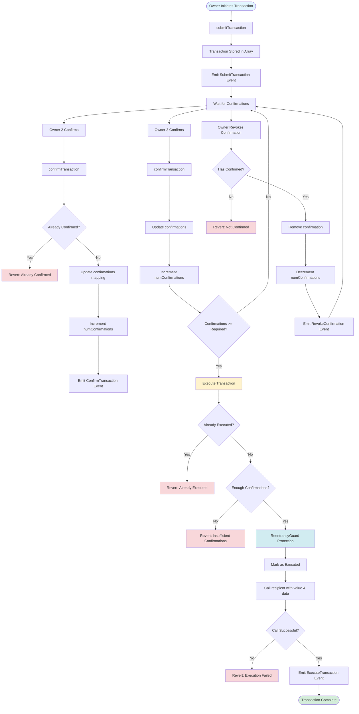
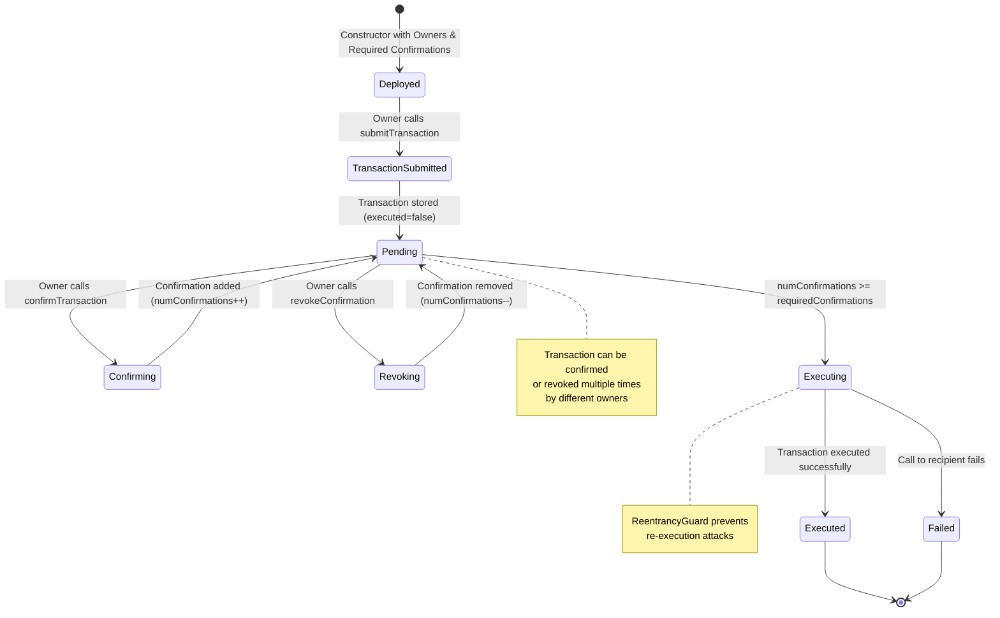
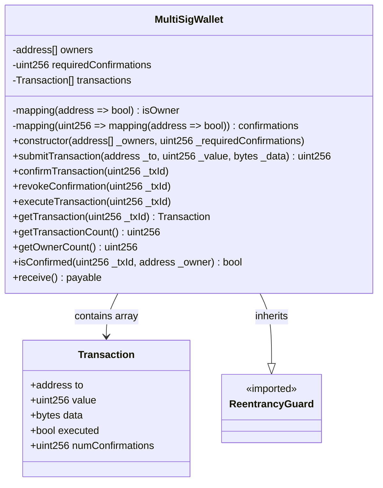

# Rootstock Multisignature Wallet

A secure multisignature wallet implementation for Rootstock (RSK) blockchain built with Foundry. This project demonstrates how to build a multisig wallet that requires multiple owner approvals before executing transactions, showcasing Rootstock's EVM compatibility.

## 📋 Table of Contents

- [Overview](#overview)
- [Features](#features)
- [Requirements](#requirements)
- [Installation](#installation)
- [Usage](#usage)
- [Testing](#testing)
- [Deployment](#deployment)
- [Contract Verification](#contract-verification)
- [Project Structure](#project-structure)
- [Security Considerations](#security-considerations)
- [License](#license)

## 🎯 Overview

This multisignature wallet contract allows a group of owners to control a wallet collectively. Transactions require a minimum number of confirmations from owners before they can be executed. This provides enhanced security compared to single-signature wallets.

**Key Concepts:**
- **Owners**: Addresses that can submit, confirm, and execute transactions
- **Required Confirmations**: Minimum number of owner approvals needed to execute a transaction
- **Transactions**: Proposals to send RBTC/ETH or call contracts
- **Confirmations**: Owner approvals for pending transactions

## ✨ Features

- ✅ Multi-owner support (configurable number of owners)
- ✅ Configurable required confirmations (M-of-N scheme)
- ✅ Transaction submission, confirmation, and execution
- ✅ Confirmation revocation (before execution)
- ✅ Safe ETH/RBTC transfers using `call()`
- ✅ Reentrancy protection
- ✅ Comprehensive event logging
- ✅ Gas-efficient design
- ✅ Full Foundry test coverage

## 📦 Requirements

- [Foundry](https://book.getfoundry.sh/getting-started/installation) (latest version)
- Node.js 16+ (optional, for frontend integration)
- Rootstock testnet RBTC (for deployment)

## 🚀 Installation

1. **Clone the repository** (if not already done):
```bash
git clone https://github.com/sainath5001/RootSafe_Multisig_Wallet.git
cd RootSafe_Multisig_Wallet/contracts
```

2. **Install dependencies**:
```bash
forge install
```

This will install OpenZeppelin contracts (for ReentrancyGuard) and forge-std (for testing).

3. **Verify installation**:
```bash
forge --version
```

## 🧪 Testing

Run all tests:

```bash
forge test
```

Run tests with verbose output:

```bash
forge test -vvv
```

Run a specific test:

```bash
forge test --match-test test_ExecuteTransactionWithEnoughConfirmations
```

Run tests with gas reporting:

```bash
forge test --gas-report
```

### Test Coverage

The test suite includes:

- ✅ Constructor validation (empty owners, invalid confirmations, duplicates)
- ✅ Transaction submission (by owners and non-owners)
- ✅ Transaction confirmation
- ✅ Transaction execution with sufficient confirmations
- ✅ Confirmation revocation
- ✅ Revert conditions (non-owner, insufficient confirmations, already executed)
- ✅ Integration tests (full flows)
- ✅ Multiple transactions handling
- ✅ View function tests

## 🏗️ Building

Compile the contracts:

```bash
forge build
```

This will:
- Compile all contracts
- Generate artifacts in `out/` directory
- Create ABI files in `out/MultiSigWallet.sol/MultiSigWallet.json`

**ABI Location**: `out/MultiSigWallet.sol/MultiSigWallet.json`

The ABI can be used by frontend applications to interact with the deployed contract.

## 🚢 Deployment

### Prerequisites

1. **Get Rootstock Testnet RBTC**:
   - Use the [Rootstock Testnet Faucet](https://faucet.rsk.co/)
   - Or use a service like [QuickNode](https://www.quicknode.com/) or [Infura](https://www.infura.io/)

2. **Set up environment variables**:

Create a `.env` file in the `contracts` directory:

```bash
# Rootstock Testnet RPC URL (see examples below)
ROOTSTOCK_TESTNET_RPC=https://public-node.testnet.rsk.co

# Deployer private key (without 0x prefix)
PRIVATE_KEY=your_private_key_here

# Optional: Custom owners (comma-separated addresses)
OWNERS=0x123...,0x456...,0x789...

# Optional: Required confirmations (default: 2)
REQUIRED_CONFIRMATIONS=2
```

### Rootstock Testnet RPC URLs

**Public RPC:**
```
https://public-node.testnet.rsk.co
```

**Third-party RPC providers** (require API keys):
- **QuickNode**: `https://rsk-testnet.g.alchemy.com/v2/YOUR_API_KEY`
- **Infura**: `https://rootstock-testnet.infura.io/v3/YOUR_PROJECT_ID`
- **Ankr**: `https://rpc.ankr.com/rsk_testnet`

**Chain ID**: `31` (Rootstock Testnet)
**Chain ID**: `30` (Rootstock Mainnet)

### Deploy to Rootstock Testnet

**Important**: Before deploying, you must load environment variables from your `.env` file:

```bash
# Load environment variables from .env file
set -a && source .env && set +a
```

**Basic deployment** (uses default owners from script):

```bash
# Load environment variables first
set -a && source .env && set +a

# Then deploy
forge script script/DeployMultiSig.s.sol:DeployMultiSig \
  --fork-url $ROOTSTOCK_TESTNET_RPC \
  --private-key $PRIVATE_KEY \
  --broadcast --legacy
```

**With custom owners and confirmations**:

```bash
# Load environment variables first
set -a && source .env && set +a

# Then deploy with custom owners
OWNERS="0x742d35Cc6634C0532925a3b844Bc9e7595f0bEb,0x8ba1f109551bD432803012645Hac136c22C929e,0x1234567890123456789012345678901234567890" \
REQUIRED_CONFIRMATIONS=2 \
forge script script/DeployMultiSig.s.sol:DeployMultiSig \
  --fork-url $ROOTSTOCK_TESTNET_RPC \
  --private-key $PRIVATE_KEY \
  --broadcast --legacy
```

**With verification** (if Rootstock explorer supports it):

```bash
# Load environment variables first
set -a && source .env && set +a

# Then deploy with verification
forge script script/DeployMultiSig.s.sol:DeployMultiSig \
  --fork-url $ROOTSTOCK_TESTNET_RPC \
  --private-key $PRIVATE_KEY \
  --broadcast --legacy \
  --verify \
  --etherscan-api-key $ROOTSTOCK_API_KEY
```

### Deployment Output

After successful deployment, you'll see:

```
MultiSigWallet deployed successfully!
Contract address: 0x...
Number of owners: 3
Required confirmations: 2
```

**Important**: Save the contract address for frontend integration and verification.

## 👥 Understanding Ownership

### Ownership is Immutable

**Important**: The owners of a MultiSigWallet are set **only during deployment** and **cannot be changed** afterward. This is by design for security - the contract has no functions to add or remove owners after deployment.

**Note**: After deploying a new contract, update the frontend `.env.local` file with the new contract address.

### Important Points

- ✅ Owners are set **once** during contract deployment
- ❌ Cannot add or remove owners after deployment
- ✅ To become an owner: Deploy a new contract with your address in the `OWNERS` list
- ✅ Choose owners carefully at deployment time

## ✅ Contract Verification

### Rootstock Explorer

1. **Navigate to Rootstock Explorer**:
   - Testnet: https://explorer.testnet.rsk.co/
   - Mainnet: https://explorer.rsk.co/

2. **Search for your contract address**

3. **Click "Verify and Publish"**

4. **Verification settings**:
   - **Compiler Type**: Solidity (Single file) or Standard JSON Input
   - **Compiler Version**: `0.8.20`
   - **Optimization**: Yes, 200 runs
   - **Contract Address**: Your deployed address
   - **Contract Name**: `MultiSigWallet`
   - **Constructor Arguments**: ABI-encoded parameters

5. **Upload source code**:
   - Copy the contents of `src/MultiSigWallet.sol`
   - Include any imported contracts (OpenZeppelin) if using "Standard JSON Input"

## 📁 Project Structure

```
contracts/
├── src/
│   └── MultiSigWallet.sol          # Main multisig wallet contract
├── test/
│   └── MultiSigWallet.t.sol        # Foundry test suite
├── script/
│   └── DeployMultiSig.s.sol        # Deployment script
├── lib/
│   ├── openzeppelin-contracts/     # OpenZeppelin library
│   └── forge-std/                  # Foundry standard library
├── out/                             # Compiled artifacts and ABIs
├── foundry.toml                     # Foundry configuration
└── README.md                        # This file
```

## 🔒 Security Considerations

1. **Owner Management**: 
   - This implementation does not support adding/removing owners after deployment
   - Choose owners carefully at deployment time
   - Ensure owners have secure key management

2. **Required Confirmations**:
   - Set `requiredConfirmations` appropriately (typically 50-70% of owners)
   - Too low: Less security
   - Too high: Risk of deadlock if owners become unavailable

3. **Transaction Data**:
   - Review transaction data before confirming
   - Be cautious with contract calls that could drain funds

4. **Private Keys**:
   - Never commit private keys to version control
   - Use environment variables or hardware wallets
   - Rotate keys if compromised

5. **Reentrancy Protection**:
   - The contract uses OpenZeppelin's ReentrancyGuard
   - All external calls use `call()` with proper checks

6. **Testing**:
   - Comprehensive test suite included
   - Consider additional audits before mainnet deployment

## 📚 Additional Resources

- [Foundry Book](https://book.getfoundry.sh/)
- [Rootstock Documentation](https://developers.rsk.co/)
- [OpenZeppelin Contracts](https://docs.openzeppelin.com/contracts/)
- [Solidity Documentation](https://docs.soliditylang.org/)

## 🤝 Contributing

1. Fork the repository
2. Create a feature branch
3. Make your changes
4. Add tests for new functionality
5. Ensure all tests pass
6. Submit a pull request

## 📄 License

This project is licensed under the MIT License - see the LICENSE file for details.

## ⚠️ Disclaimer

This software is provided "as is" without warranty. Use at your own risk. Always audit smart contracts before deploying to mainnet and handling real funds.

---

**Built with ❤️ for Rootstock (RSK)**

## 📊 Architecture Diagram

The following diagram illustrates the transaction flow and contract architecture:



## 🔄 Contract State Flow



## 🏛️ Contract Structure

