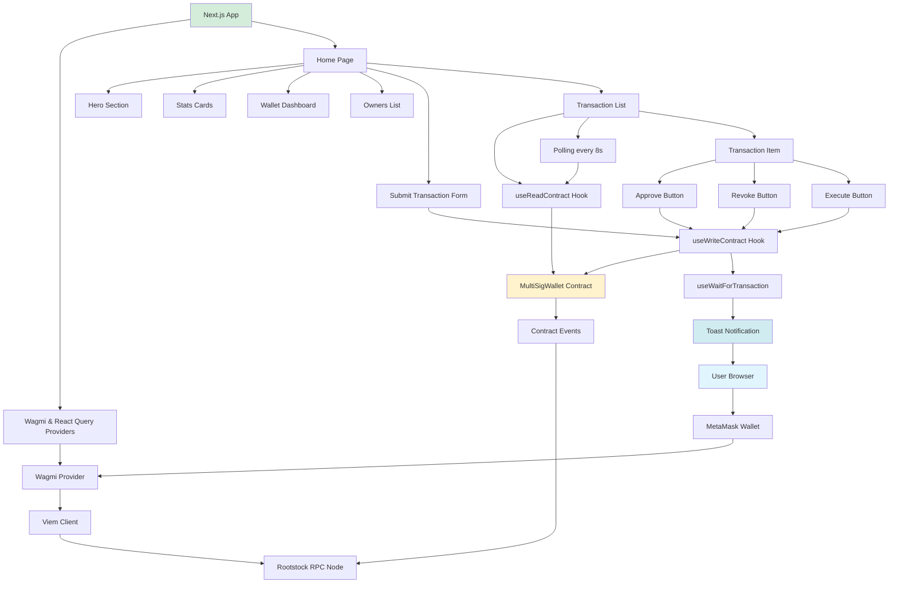
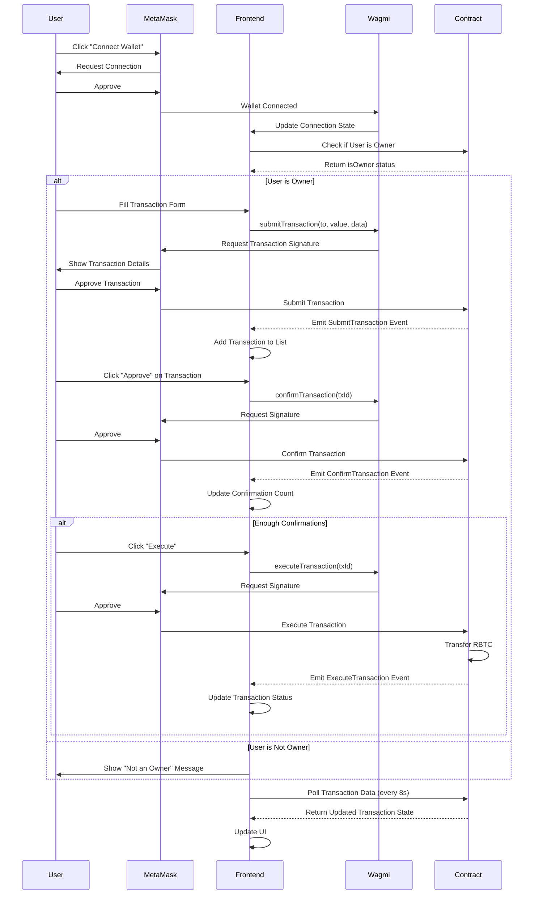
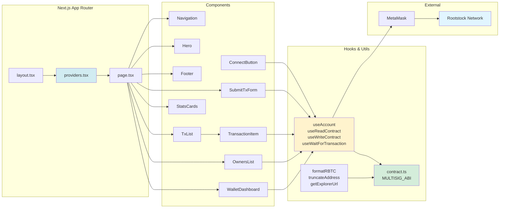
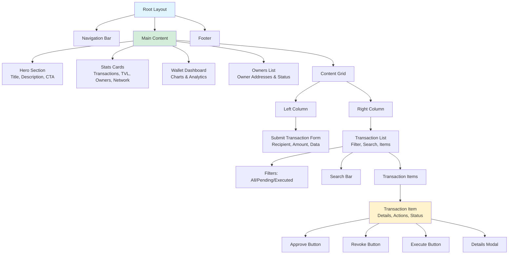

# Rootstock Multisig Wallet - Frontend

Next.js frontend application for interacting with the Rootstock Multisig Wallet smart contract.

## 🚀 Quick Start

### Prerequisites

- Node.js 18+ installed
- MetaMask browser extension
- Rootstock Testnet RBTC (for gas fees)

### Installation

1. **Install dependencies:**

```bash
npm install
```

2. **Set up environment variables:**

Copy the example environment file:

```bash
cp .env.local.example .env.local
```

Edit `.env.local` and update:

- `NEXT_PUBLIC_MULTISIG_ADDRESS` - Your deployed contract address (from Foundry deployment)
- `NEXT_PUBLIC_RPC_URL` - Rootstock Testnet RPC URL (default: public RPC)
- `NEXT_PUBLIC_CHAIN_ID` - Chain ID (31 for testnet, 30 for mainnet)

3. **Copy the ABI file:**

The ABI should already be in `src/abi/MultiSigWallet.json`. If you need to update it:

```bash
# From the contracts directory
cp ../contracts/out/MultiSigWallet.sol/MultiSigWallet.json src/abi/
# Then extract just the ABI:
node -e "const abi = require('./src/abi/MultiSigWallet.json'); console.log(JSON.stringify(abi.abi, null, 2))" > src/abi/MultiSigWallet.json
```

Or use the helper script (see below).

4. **Run the development server:**

```bash
npm run dev
```

5. **Open your browser:**

Navigate to [http://localhost:3000](http://localhost:3000)

## 📋 Getting the ABI

The ABI (Application Binary Interface) is required for the frontend to interact with the smart contract.

### Option 1: Copy from Foundry output (Recommended)

After compiling your contracts with Foundry, copy the ABI:

```bash
# From the frontend directory
cp ../contracts/out/MultiSigWallet.sol/MultiSigWallet.json src/abi/
```

Then extract just the `abi` field from the JSON file. The file should contain only the ABI array, not the full artifact.

You can extract it with:

```bash
cd src/abi
node -e "const data = require('./MultiSigWallet.json'); require('fs').writeFileSync('./MultiSigWallet.json', JSON.stringify(data.abi, null, 2))"
```

### Option 2: Use the helper script

Create a script `scripts/copy-abi.sh`:

```bash
#!/bin/bash
# Copy ABI from Foundry output to frontend
CONTRACTS_DIR="../contracts"
FRONTEND_DIR="."

# Copy the full artifact
cp "$CONTRACTS_DIR/out/MultiSigWallet.sol/MultiSigWallet.json" "$FRONTEND_DIR/src/abi/MultiSigWallet.full.json"

# Extract just the ABI
node -e "const data = require('./src/abi/MultiSigWallet.full.json'); const fs = require('fs'); fs.writeFileSync('./src/abi/MultiSigWallet.json', JSON.stringify(data.abi, null, 2))"

echo "✅ ABI copied successfully!"
```

Make it executable and run:

```bash
chmod +x scripts/copy-abi.sh
./scripts/copy-abi.sh
```

## 🔧 Configuration

### Environment Variables

Create a `.env.local` file in the frontend directory:

```bash
# Rootstock Testnet RPC URL
NEXT_PUBLIC_RPC_URL=https://public-node.testnet.rsk.co

# Chain ID (31 = Testnet, 30 = Mainnet)
NEXT_PUBLIC_CHAIN_ID=31

# Your deployed Multisig Wallet contract address
NEXT_PUBLIC_MULTISIG_ADDRESS=0x3886eC7a6ca3841944a27439126096d6978f8884

# Explorer URL (optional)
NEXT_PUBLIC_EXPLORER_URL=https://explorer.testnet.rsk.co
```

### Contract Address

Update `NEXT_PUBLIC_MULTISIG_ADDRESS` with your deployed contract address from the Foundry deployment.

You can also modify `src/lib/contract.ts` directly, but using environment variables is recommended.

## 🔗 Connecting MetaMask to Rootstock Testnet

If MetaMask doesn't have Rootstock Testnet configured:

1. Open MetaMask
2. Click the network dropdown
3. Select "Add Network" or "Add Network Manually"
4. Enter the following details:

**Network Name:** Rootstock Testnet  
**RPC URL:** `https://public-node.testnet.rsk.co`  
**Chain ID:** `31`  
**Currency Symbol:** `RBTC`  
**Block Explorer URL:** `https://explorer.testnet.rsk.co`

5. Click "Save"

## 💻 Development

### Available Scripts

- `npm run dev` - Start development server
- `npm run build` - Build for production
- `npm start` - Start production server
- `npm run lint` - Run ESLint

### Project Structure

```
frontend/
├── src/
│   ├── app/              # Next.js app router
│   │   ├── layout.tsx    # Root layout with providers
│   │   ├── page.tsx      # Home page
│   │   ├── providers.tsx # Wagmi & React Query providers
│   │   └── globals.css   # Global styles
│   ├── components/       # React components
│   │   ├── ConnectButton.tsx    # Wallet connection
│   │   ├── SubmitTxForm.tsx     # Transaction submission form
│   │   ├── TxList.tsx           # Transaction list
│   │   └── TransactionItem.tsx  # Individual transaction item
│   ├── lib/              # Utilities
│   │   ├── contract.ts   # Contract configuration & ABI
│   │   └── utils.ts      # Helper functions
│   └── abi/              # Contract ABIs
│       └── MultiSigWallet.json
├── .env.local.example    # Environment variables template
├── next.config.js        # Next.js configuration
├── tailwind.config.js    # Tailwind CSS configuration
├── tsconfig.json         # TypeScript configuration
└── package.json          # Dependencies
```

## 🎯 Features

- ✅ Connect MetaMask wallet
- ✅ View multisig wallet information (owners, confirmations, balance)
- ✅ Submit new transactions
- ✅ View all transactions with status
- ✅ Approve/Revoke transaction confirmations (owners only)
- ✅ Execute transactions when enough confirmations (owners only)
- ✅ Real-time transaction updates (polls every 8 seconds)
- ✅ Transaction status indicators
- ✅ Responsive design with Tailwind CSS

## 📝 Usage Guide

### For Owners

1. **Connect Wallet:** Click "Connect Wallet" and approve in MetaMask
2. **Submit Transaction:**
   - Fill in recipient address
   - Enter amount in RBTC
   - Optionally add data (hex string, leave empty for simple transfer)
   - Click "Submit Transaction"
3. **Approve Transaction:**
   - Find the transaction in the list
   - Click "Approve" button
   - Confirm in MetaMask
4. **Execute Transaction:**
   - When enough owners have approved (meets required confirmations)
   - The "Execute" button will appear
   - Click "Execute" and confirm in MetaMask

### For Non-Owners

- You can view the contract and transactions
- You cannot submit, approve, or execute transactions
- A warning message will be displayed

## 🔒 Security Notes

- Always verify the contract address before connecting
- Double-check transaction details before approving
- This is a demo application - use at your own risk
- For production use, consider additional security measures

## 🐛 Troubleshooting

### "Failed to connect to wallet"

- Make sure MetaMask is installed and unlocked
- Check that you're on the correct network (Rootstock Testnet)
- Try refreshing the page

### "Contract not found"

- Verify the contract address in `.env.local`
- Make sure the contract is deployed on Rootstock Testnet
- Check the contract address on the explorer

### "Transaction failed"

- Check you have enough RBTC for gas
- Verify you're an owner of the multisig wallet
- Check transaction requirements (enough confirmations, not already executed)

### "Cannot read properties"

- Make sure the ABI file is properly formatted (JSON array)
- Verify the ABI matches the deployed contract
- Try rebuilding: `npm run build`

## 📚 Resources

- [Next.js Documentation](https://nextjs.org/docs)
- [Wagmi Documentation](https://wagmi.sh/)
- [Viem Documentation](https://viem.sh/)
- [Rootstock Documentation](https://developers.rsk.co/)
- [Tailwind CSS](https://tailwindcss.com/docs)

## 📄 License

MIT License - see LICENSE file for details

---

**Built with ❤️ for Rootstock (RSK)**

## 📊 Frontend Architecture Diagram

The following diagram illustrates the frontend architecture and data flow:



## 🔄 User Flow Diagram



## 🏗️ Component Architecture



## 📱 Page Structure


